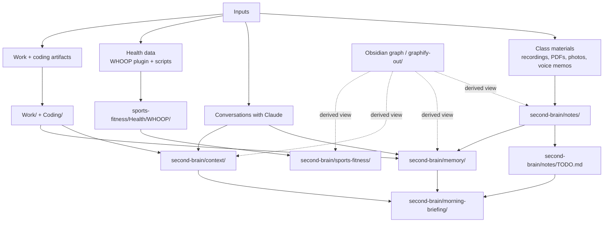

# Vault Map

How this second brain is organized, where information enters, and where it gets promoted.

## Visual Map

## Canonical Layout

| Area | Role | Canonical content |
|---|---|---|
| `second-brain/context/` | Current-state profile | facts about Sri, semester, projects, preferences, relationships |
| `second-brain/memory/` | Long-term AI memory wiki | entities, topics, conversation summaries, logs, schema |
| `second-brain/notes/` | Academic knowledge base | course notes, assignments, exams, flashcards |
| `second-brain/morning-briefing/` | Daily execution layer | daily priorities pulled from tasks + context |
| `second-brain/sports-fitness/` | Curated fitness hub | training, goals, measurements, sleep log, workout history |
| `sports-fitness/Health/WHOOP/` | Raw biometric feed | daily WHOOP notes created by plugin/import |
| `Work/` | Career materials | co-op notes, cover letters, job materials |
| `Coding/` | Project/code area | portfolio and coding projects |
| `graphify-out/` | Generated graph artifacts | derived graph/report output, not source of truth |

## How Information Moves

1. Raw material enters through class files, conversations, work artifacts, and WHOOP.
2. Structured academic notes land in `second-brain/notes/`.
3. Durable facts about Sri get promoted into `second-brain/context/`.
4. Cross-session assistant knowledge gets written into `second-brain/memory/`.
5. Tasks are consolidated into `second-brain/notes/TODO.md`.
6. Morning plans are written into `second-brain/morning-briefing/`.
7. WHOOP daily files stay in `sports-fitness/Health/WHOOP/`, while summaries and history live in `second-brain/sports-fitness/`.

## Source-Of-Truth Rules

- Keep raw WHOOP daily notes only in `sports-fitness/Health/WHOOP/`.
- Keep curated fitness summaries in `second-brain/sports-fitness/`.
- Keep stable personal/semester facts in `second-brain/context/`.
- Keep assistant-usable long-term memory in `second-brain/memory/`.
- Treat `graphify-out/` as generated output that can become stale.

## Duplicate Cleanup Completed

- Removed the duplicate WHOOP daily note at `second-brain/sports-fitness/Health/WHOOP/2026/daily-2026-04-14.md`.
- Canonical copy remains at `sports-fitness/Health/WHOOP/2026/daily-2026-04-14.md`.
- Left `.obsidian/` files alone because the root vault and nested `second-brain/` vault appear intentionally configured as separate Obsidian scopes.
