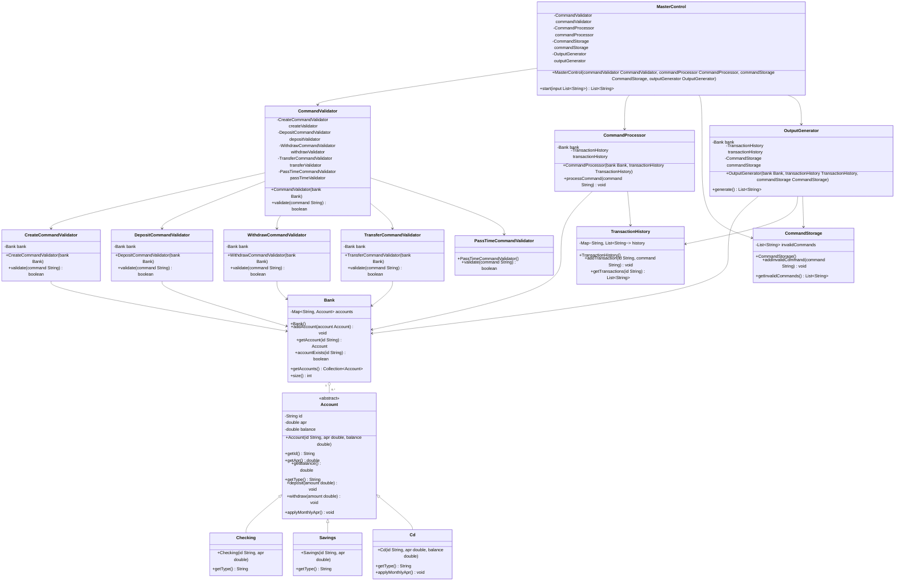

# SE-201 BankSystem — UML Class Diagram

```mermaid
%%{init: {'theme': 'default', 'themeVariables': {'fontSize': '20px'}}}%%
classDiagram
    direction TB

    class Account {
        <<abstract>>
        -String id
        -double apr
        -double balance
        +Account(id String, apr double, balance double)
        +getId() String
        +getApr() double
        +getBalance() double
        +getType() String
        +deposit(amount double) void
        +withdraw(amount double) void
        +applyMonthlyApr() void
    }

    class Checking {
        +Checking(id String, apr double)
        +getType() String
    }

    class Savings {
        +Savings(id String, apr double)
        +getType() String
    }

    class Cd {
        +Cd(id String, apr double, balance double)
        +getType() String
        +applyMonthlyApr() void
    }

    class Bank {
        -Map~String, Account~ accounts
        +Bank()
        +addAccount(account Account) void
        +getAccount(id String) Account
        +accountExists(id String) boolean
        +getAccounts() Collection~Account~
        +size() int
    }

    class CommandValidator {
        -CreateCommandValidator createValidator
        -DepositCommandValidator depositValidator
        -WithdrawCommandValidator withdrawValidator
        -TransferCommandValidator transferValidator
        -PassTimeCommandValidator passTimeValidator
        +CommandValidator(bank Bank)
        +validate(command String) boolean
    }

    class CreateCommandValidator {
        -Bank bank
        +CreateCommandValidator(bank Bank)
        +validate(command String) boolean
    }

    class DepositCommandValidator {
        -Bank bank
        +DepositCommandValidator(bank Bank)
        +validate(command String) boolean
    }

    class WithdrawCommandValidator {
        -Bank bank
        +WithdrawCommandValidator(bank Bank)
        +validate(command String) boolean
    }

    class TransferCommandValidator {
        -Bank bank
        +TransferCommandValidator(bank Bank)
        +validate(command String) boolean
    }

    class PassTimeCommandValidator {
        +PassTimeCommandValidator()
        +validate(command String) boolean
    }

    class CommandProcessor {
        -Bank bank
        -TransactionHistory transactionHistory
        +CommandProcessor(bank Bank, transactionHistory TransactionHistory)
        +processCommand(command String) void
    }

    class CommandStorage {
        -List~String~ invalidCommands
        +CommandStorage()
        +addInvalidCommand(command String) void
        +getInvalidCommands() List~String~
    }

    class TransactionHistory {
        -Map~String, List~String~~ history
        +TransactionHistory()
        +addTransaction(id String, command String) void
        +getTransactions(id String) List~String~
    }

    class OutputGenerator {
        -Bank bank
        -TransactionHistory transactionHistory
        -CommandStorage commandStorage
        +OutputGenerator(bank Bank, transactionHistory TransactionHistory, commandStorage CommandStorage)
        +generate() List~String~
    }

    class MasterControl {
        -CommandValidator commandValidator
        -CommandProcessor commandProcessor
        -CommandStorage commandStorage
        -OutputGenerator outputGenerator
        +MasterControl(commandValidator CommandValidator, commandProcessor CommandProcessor, commandStorage CommandStorage, outputGenerator OutputGenerator)
        +start(input List~String~) List~String~
    }

    Account <|-- Checking
    Account <|-- Savings
    Account <|-- Cd

    Bank "1" o-- "0..*" Account

    CommandValidator --> CreateCommandValidator
    CommandValidator --> DepositCommandValidator
    CommandValidator --> WithdrawCommandValidator
    CommandValidator --> TransferCommandValidator
    CommandValidator --> PassTimeCommandValidator

    CreateCommandValidator --> Bank
    DepositCommandValidator --> Bank
    WithdrawCommandValidator --> Bank
    TransferCommandValidator --> Bank

    CommandProcessor --> Bank
    CommandProcessor --> TransactionHistory

    OutputGenerator --> Bank
    OutputGenerator --> TransactionHistory
    OutputGenerator --> CommandStorage

    MasterControl --> CommandValidator
    MasterControl --> CommandProcessor
    MasterControl --> CommandStorage
    MasterControl --> OutputGenerator
```
